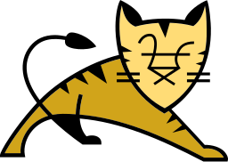

# WebDevEssentials
Web開発で用いられる技術の概要を載せています。  
**概要はChatGPTを使用して生成したものです。内容が誤っている可能性もあります。**

**目次**
- [HTML](#html)
- [JavaScript](#javascript)
- [CSS](#css)
- [jQuery](#jquery)
- [Java](#java)
- [Apache Tomcat](#apache-tomcat)
- [Struts](#struts)
- [Spring Framework](#spring-framework)
- [Apache HTTP Server](#apache-http-server)
- [Nginx](#nginx)
- [PostgreSQL](#postgresql)
- [MySQL](#mysql)
- [SQL](#sql)
- [Python](#python)

## HTML

### 概要
HTMLはウェブページの作成に使用される標準的なマークアップ言語であり、`<html>`、`<head>`、`<body>`などのタグを用いて文書の構造を定義します。  
これらのタグには属性を設定することができ、ウェブページの動作や表示を詳細に制御することが可能です。  
HTML文書は、メタデータ、表示されるコンテンツ、リンク、画像、リスト、テーブル、フォームなどから構成され、セマンティックHTMLを活用することでコンテンツの構造を明確にし、アクセシビリティを高めることができます。  
また、HTMLはCSSやJavaScriptと組み合わせることにより、動的かつインタラクティブなウェブページを作成することが可能です。
### サイト
- [HTML の基本 - ウェブ開発を学ぶ | MDN](https://developer.mozilla.org/ja/docs/Learn/Getting_started_with_the_web/HTML_basics)
## JavaScript

### 概要
JavaScriptはウェブページに動的要素とインタラクティブ機能を加えるプログラミング言語です。  
主にクライアントサイドでブラウザ内で実行されるものの、Node.jsなどを使用してサーバーサイドでも適用可能です。  
イベント駆動プログラミング、DOM操作、非同期通信（Ajax）、および現代のフレームワークやライブラリ（React、Angular、Vue.js）を活用することで、開発を効率化することができます。  
JavaScriptは、多様なデータ型、関数、ECMAScript標準の発展、プロミスやasync/awaitを用いた非同期処理のサポートを通じて、ウェブ開発におけるインタラクティビティとユーザーエクスペリエンスを向上させます。
### サイト
- [JavaScript | MDN](https://developer.mozilla.org/ja/docs/Web/JavaScript)

## CSS

### 概要
CSSはウェブページのスタイリングに用いられ、HTML要素に色、フォント、レイアウトなどの視覚的スタイルを適用する言語です。  
セレクタを用いて特定の要素にスタイルを定義し、カスケーディングルールによりスタイルの優先順位を決定します。  
ボックスモデルに基づく要素の配置、FlexboxやGridによるレイアウト設計、メディアクエリを活用したレスポンシブデザインの実装、アニメーションやトランジションを使用した動的効果の追加など、多様な機能を提供します。  
さらに、CSS変数や前処理器の使用により、スタイルシートの管理と記述が効率化されます。  
CSSは、HTMLとJavaScriptとともに、ウェブ開発の核となる技術です。
### サイト
- [CSS: カスケーディングスタイルシート | MDN](https://developer.mozilla.org/ja/docs/Web/CSS)

## jQuery

### 概要
jQueryはJavaScriptのライブラリであり、DOM操作、イベントハンドリング、Ajax通信を容易にし、クロスブラウザ互換性を提供します。  
これにより、要素の選択や変更、ユーザーイベントの処理、ビジュアルエフェクトの適用が容易になります。  
jQueryのメソッドはチェーン可能であり、複数の操作を簡潔なコードで記述でき、多様なプラグインによって機能を拡張できます。  
その軽量さと広範囲な利用により、jQueryはウェブ開発における標準的なツールの一つとして広く採用されています。
### サイト
- [jQuery](https://jquery.com/)

## Java

### 概要
Javaはオブジェクト指向プログラミング言語で、1995年にSun Microsystemsによって開発され、現在Oracleが所有しています。  
その「Write Once, Run Anywhere」の理念のもと、Java Virtual Machine（JVM）上でプラットフォームに依存せず実行可能です。  
クラスベースのオブジェクト指向性を持ち、再利用可能なコードモジュールの作成を容易にします。  
また、ファイル処理、ネットワーク通信、データベース接続などをサポートする豊富な標準ライブラリを備えています。  
自動メモリ管理によるガベージコレクションを用いてメモリリークのリスクを減らし、実行時のコード検証、メモリ管理、例外処理により安全なプログラミングを実現します。  
Javaはウェブ、エンタープライズ、モバイル（特にAndroid）、組み込みシステムなど多様なアプリケーションで使用されており、Eclipse、IntelliJ IDEA、NetBeansなどの強力な開発ツールをサポートします。  
広範な開発者コミュニティ、学習資料、ドキュメント、フォーラムが存在し、その汎用性、安全性、移植性の高さから、世界中で広く使われています。
### サイト
- [Java | Oracle](https://www.java.com/ja/)

## Apache Tomcat

### 概要
Apache Tomcatは、JavaサーブレットとJavaServer Pages（JSP）を実行するオープンソースのWebサーバーおよびサーブレットコンテナです。  
このソフトウェアは無料で提供されており、ソースコードにもアクセスできます。  
Javaを利用したWebアプリケーション開発に特化し、軽量性とスケーラビリティのバランスが取れているため、小規模から大規模なWebアプリケーションの開発に適しています。  
Apache Software Foundationが管理し、定期的な更新を通じてその信頼性と最新性を保証しています。  
設定と管理の容易さにより、開発者は迅速に開発環境を構築でき、多数の商用およびオープンソースWebアプリケーションで使用されています。  
Apache Tomcatは、信頼性と拡張性に優れたJavaベースのWebアプリケーションの開発および展開に適した選択肢です。
### サイト
- [Apache Tomcat® - Welcome!](https://tomcat.apache.org/)

## Struts

### 概要
Strutsは、JavaでのWebアプリケーション開発を支援するオープンソースフレームワークです。  
これはMVC（Model-View-Controller）アーキテクチャに基づき設計されており、フォームデータのバリデーション、多言語対応の国際化、プラグインによる拡張性など、様々な特徴を備えています。  
リクエストをアクションクラスにマッピングするアクションベースの仕組みを採用している点も特徴の一つです。  
Apache Software Foundationによって管理されているこのフレームワークは、その拡張性の高さから多くの開発者に利用されています。  
しかし、近年ではSpring MVCなどの他のフレームワークへの移行が増えている状況です。
### サイト
- [Welcome to the Apache Struts project](https://struts.apache.org/)

## Spring Framework

### 概要
Spring FrameworkはJava用のオープンソースアプリケーションフレームワークであり、プログラミングと設定のための包括的なモデルを提供します。  
その主要な特徴は、依存性注入（DI）による疎結合アプリケーションの開発支援、アスペクト指向プログラミング（AOP）に基づく宣言的トランザクション管理、モジュラーなコンポーネントの使用による開発の支援、Spring MVCを利用したWebアプリケーション開発の簡素化、そしてJDBCとORMフレームワークの統合によるデータアクセスの抽象化と簡易化にあります。  
これらの機能によって、Spring Frameworkは企業向けアプリケーション開発において柔軟性、強力な機能性、簡潔な開発モデルを提供し、広く採用されています。
### サイト
- [Spring Framework](https://spring.io/projects/spring-framework)

## Apache HTTP Server

### 概要
Apache HTTP Serverは世界中で広く使用されているWebサーバーソフトウェアで、オープンソースで開発され、多機能かつ拡張性に富むモジュール式アーキテクチャを有しています。  
SSL/TLSによる暗号化通信をサポートし、設定ファイルを通じて高度なカスタマイズが可能です。  
また、様々なオペレーティングシステムで利用できることも特長の一つです。  
その信頼性と柔軟性により、Apacheは長年にわたって多くのWebサイトやアプリケーションの基盤として利用されてきました。
### サイト
- [Welcome! - The Apache HTTP Server Project](https://httpd.apache.org/)

## Nginx

### 概要
Nginxは、高性能なHTTPおよびリバースプロキシサーバー、メールプロキシサーバーの機能を有するオープンソースソフトウェアです。  
非同期イベント駆動アーキテクチャにより高パフォーマンスと安定性を実現し、軽量でメモリ効率が良いことを特長としています。  
静的コンテンツの迅速な配信、ロードバランシング、フォルトトレランスをサポートする他、SSLおよびTLSによるセキュリティの強化や、柔軟で拡張性の高い設定が可能です。  
これらの特長により、Nginxは世界中の多くの高トラフィックサイトで広く利用されています。
### サイト
- [NGINX(エンジンエックス)｜日本公式サイト](https://www.nginx.co.jp/)

## PostgreSQL

### 概要
PostgreSQLは、高度な機能、信頼性、及び拡張性を提供するオープンソースのオブジェクトリレーショナルデータベースシステムです。  
商用データベースと匹敵する機能を有し、SQL言語の幅広い標準及びプロシージャ言語のサポートを特長としています。  
トランザクション管理と同時実行制御を通じてデータの整合性を維持し、地理空間データのサポート（PostGISを通じ）でGISシステムへの対応も可能にします。  
さらに、多様なインデックスタイプ、フルテキスト検索、複雑なクエリの最適化、高度なセキュリティ機能、及び拡張性の高い認証システムを搭載しています。  
これらの特長により、PostgreSQLは多様なアプリケーションで堅牢なデータベース管理システムとして広く用いられています。
### サイト
- [PostgreSQL: The world's most advanced open source database](https://www.postgresql.org/)

## MySQL

### 概要
MySQLはGPLライセンスのもとで利用可能なオープンソースのリレーショナルデータベース管理システム（RDBMS）です。  
SQLを用いてデータを操作し、多くのオペレーティングシステムに対応しています。  
レプリケーションやパーティショニングなどの高度な機能を備え、特にWebベースのアプリケーションで広く使用されています。  
Oracle Corporationが開発とサポートを行っており、使いやすさ、柔軟性、堅牢な機能セットにより、小規模プロジェクトから大規模エンタープライズアプリケーションまで幅広い用途で信頼されています。
### サイト
- [MySQL](https://www.mysql.com/jp/)

## SQL

### 概要
SQL（Structured Query Language）は、リレーショナルデータベース管理システム（RDBMS）でのデータ管理に用いられる標準の言語です。  
この言語は、データの定義、操作、および制御を目的としており、データベーススキーマの作成や変更、データの挿入・更新・削除、特定情報を検索するクエリの実行、データの整合性やセキュリティの維持、トランザクションの管理を行うことができます。  
効率的なデータ管理とビジネス要件に柔軟に対応するため、広く利用されています。
### サイト
- [SQL - Wikipedia](https://ja.wikipedia.org/wiki/SQL)

## Python

### 概要
Pythonは、読みやすくシンプルなコードを重視する汎用性の高いプログラミング言語です。  
インタプリタ式でありコンパイルが不要で、オブジェクト指向、手続き型、関数型プログラミングをサポートしています。  
自動メモリ管理と動的型付けを特徴とし、標準ライブラリやサードパーティ製のライブラリが豊富に存在します。  
Web開発、データ分析、人工知能など、さまざまな用途に適用できるその柔軟性と多用途性から、幅広い範囲の開発者に支持されています。
### サイト
- [Welcome to Python.org](https://www.python.org/)

